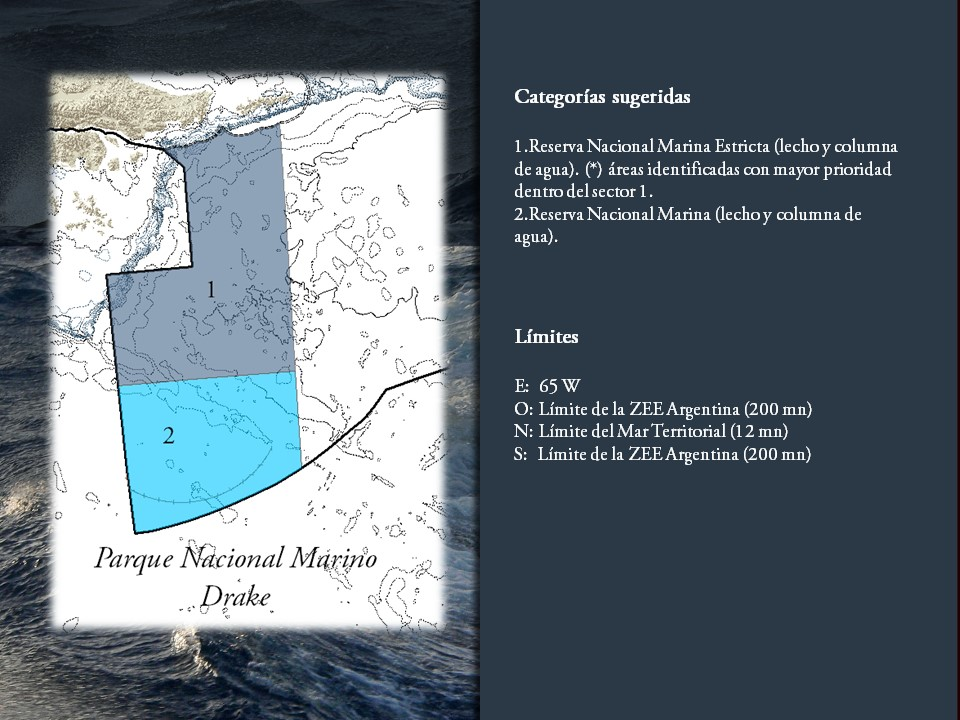

```{r message=FALSE, error=FALSE, warning=F, echo=FALSE, prompt=FALSE}
suppressPackageStartupMessages(
  easypackages::libraries("knitr", "tidyverse", "bigrquery", "lubridate", "broom","modelr", "DBI", "trelliscopejs",  "cowplot", "gtable", "grid", "ggsci", "stringr", "mregions", "sf", "grid", "gridExtra", "ggmap")
)

knitr::opts_chunk$set(warning = FALSE, message = FALSE, comment = F,error = FALSE, echo = FALSE, progress = F)

knitr::knit_hooks$set(inline = function(x) {
  prettyNum(round(x,2), big.mark = ",")
})

BQ_connection <-  dbConnect(dbi_driver(), dataset = "", project = "world-fishing-827")

source("gfw_themes.R")
```

This analysis uses Global Fishign Watch data to examine the amount of fishing effort that occurs within the areas being considered for protection in Southern Argentina (Fig 1). This area is located withing the EEZ west of 65º and extends from 12-200 nm from shore (Figure 1) 



# All effort in Argentina EEZ

```{sql connection = BQ_connection, output.var = "all_effort_in_EEZ", eval = FALSE}
SELECT
  a.year year,
  a.mmsi mmsi,
  b.on_fishing_list on_fishing_list,
  b.on_fishing_list_nn on_fishing_list_nn,
  b.flag_country_name flag_country_name,
  b.flag_iso3 flag_iso3,
  b.known_label known_label,
  b.inferred_label_allyears inferred_label_allyears,
  b.inferred_sublabel_allyears inferred_sublabel_allyears,
  b.length length,
  b.tonnage tonnage,
  b.engine_power engine_power,
  EXACT_COUNT_DISTINCT(DATE(timestamp)) days,
  SUM(a.hours) hours,
  EXACT_COUNT_DISTINCT(IF(a.nnet_score == 1, DATE(timestamp), NULL)) fishing_days,
  SUM(IF(a.nnet_score == 1, a.hours, 0)) fishing_hours,
  SUM(IF(a.nnet_score == 1, a.hours*b.engine_power, 0)) fishing_kwh
FROM (
  SELECT
    YEAR(timestamp) year,
    mmsi,
    timestamp,
    seg_id,
    lon,
    lat,
    hours,
    nnet_score,
    eez_name
  FROM
    [world-fishing-827:gfw_research.nn]
  WHERE
    _PARTITIONTIME BETWEEN TIMESTAMP('2014-01-01')
    AND TIMESTAMP('2016-12-31')
    AND (eez_name == "Argentina" OR eez_name == "Falkland Islands")
    AND seg_id IN (SELECT seg_id FROM [world-fishing-827:gfw_research.good_segments])
    ) a
INNER JOIN (
  SELECT
    mmsi,
    year,
    on_fishing_list,
    on_fishing_list_nn,
    country_name flag_country_name,
    iso3 flag_iso3,
    inferred_label_allyears,
    inferred_sublabel_allyears,
    known_label,
    IF(known_length IS NOT NULL, known_length, inferred_length ) length,
    IF(known_tonnage IS NOT NULL, known_tonnage, inferred_tonnage ) tonnage,
    IF(known_engine_power IS NOT NULL, known_engine_power, inferred_engine_power ) engine_power
  FROM
    [gfw_research.vessel_info_20170717]
  WHERE
    (on_fishing_list_nn
      OR on_fishing_list)
    AND offsetting IS NULL)b
ON
  a.mmsi = b.mmsi
  AND a.year = b.year
GROUP BY
  year,
  mmsi,
  on_fishing_list,
  on_fishing_list_nn, 
  flag_country_name,
  flag_iso3,
  known_label,
  inferred_label_allyears,
  inferred_sublabel_allyears,
  length,
  tonnage,
  engine_power
  having fishing_hours > 0
```

```{r, eval = FALSE}
write_csv(all_effort_in_EEZ, "saved_files/all_effort_in_EEZ.csv")
```

```{r}
all_effort_in_EEZ <- read_csv("saved_files/all_effort_in_EEZ.csv")
```

Between 2014-2016, we observed a total of `r n_distinct(all_effort_in_EEZ$mmsi)` vessels fishing within Argentina's EEZ. Of these, `r n_distinct(filter(all_effort_in_EEZ,flag_iso3 == "ARG")$mmsi)` are Argentinian flagged vessels, which accounted for 93% of all fishing effort measured in Kilowatt hours (Table 1). The foreign vessels representing the rest of the fishing effort are predominantly from Chile, Uruguay, China, South Korea and Taiwan (Figure 1). The largest Argentinian fleet excerting most of the fishing effort are trawlers, followed by longliners and squid jiggers (Table 3). In terms of the foreign fleets, the most predominant ones are Uruguyan trawlers and Chinese squid jiggers (Table 3).

```{r }
all_effort_in_EEZ$flag_country_name[all_effort_in_EEZ$flag_country_name == "Invalid MMSI"] <- "Unknown"

all_effort_in_EEZ$inferred_label_allyears[all_effort_in_EEZ$mmsi == 470140810] <- "trawlers"
all_effort_in_EEZ$inferred_sublabel_allyears[all_effort_in_EEZ$mmsi == 470140810] <- "trawlers"
all_effort_in_EEZ$flag_country_name[all_effort_in_EEZ$mmsi == 470140810] <- "Argentina"
all_effort_in_EEZ$flag_iso3[all_effort_in_EEZ$mmsi == 470140810] <- "ARG"


all_effort_in_EEZ %>%
  filter(fishing_hours > 1) %>% 
  group_by(year) %>% 
  summarise(all_vessels = n_distinct(mmsi),
            arg_vessels = n_distinct(mmsi[flag_iso3 == "ARG"]),
            fishing_days_all = sum(fishing_days),
            fishing_days_arg = sum(fishing_days[flag_country_name == 'Argentina']),
            fishing_energy = round(sum(fishing_kwh, na.rm = T)/10^6),
            fishing_energy_arg = round(sum(fishing_kwh[flag_country_name == 'Argentina'])/10^6)) %>% 
  kable(caption = "table 1. Fishing vessels and Fishing days in Argentina's EEZ (2014-2016)",
        col.names = c("Year", "Total vessels", "Argentinian vessels", "Total fishing days", "Argentinian fishing days", "Fishing energy (million KWh)", "Argentina fishing energy (million KWh)"))
```


```{r fig.cap = "Figure 1. Number of fishing vesssels and total fishing energy spent (million KWh) by flag state in 2016"}
(bar_plot_by_country <- all_effort_in_EEZ %>%
  filter(fishing_hours > 1 & year == 2016) %>%
  group_by(flag_country_name) %>% 
  summarise(vessels = n_distinct(mmsi),
            fishing_energy = sum(fishing_kwh)/10^6) %>% 
  top_n(8,vessels) %>%
  gather(variable, value, -flag_country_name) %>% 
  ggplot(aes(x = forcats::fct_reorder(flag_country_name, value), y = value, fill = variable))+
  geom_col(position = "dodge")+
  guides(fill = FALSE) +
  coord_flip()+
  labs(y = "Vessels", x = "")+
  facet_wrap("variable", scales = 'free'))+
  scale_fill_npg()

tiff("saved_plots/bar_plot_by_country.tiff", height = 12, width = 20, units = 'cm', compression = "lzw", res = 300)
    
print(bar_plot_by_country)
    
invisible(dev.off())
```


```{r}
all_effort_in_EEZ %>%
  filter(fishing_hours > 1 & year == 2016 & flag_country_name == "Argentina" & !inferred_label_allyears %in% c("reefer","cargo_or_tanker", "tanker", "cargo") & !is.na(inferred_label_allyears)) %>%
  select(-flag_country_name) %>% 
  group_by(inferred_label_allyears) %>% 
  summarise(vessels = n_distinct(mmsi),
            fishing_days = sum(fishing_days),
            fishing_energy = round(sum(fishing_kwh)/10^6, digits = 2)) %>% 
  ungroup() %>% 
  top_n(10, fishing_energy) %>% 
  arrange(desc(fishing_energy)) %>% 
  kable(caption = "table 2. Fishing vessels and effort by gear type for Argentina's fleet (2016)",
        col.names = c("Gear type", "Vessels", "Fishing days","Fishing energy (million KWh)"))

all_effort_in_EEZ %>%
  filter(fishing_hours > 1 & year == 2016 & flag_country_name != "Argentina" & !inferred_sublabel_allyears %in% c("reefer","cargo_or_tanker", "tanker", "cargo")) %>%
  group_by(flag_country_name, inferred_sublabel_allyears) %>% 
  summarise(vessels = n_distinct(mmsi),
            fishing_days = sum(fishing_days),
            fishing_energy = round(sum(fishing_kwh)/10^6, digits = 2)) %>% 
  ungroup() %>% 
  top_n(10, fishing_energy) %>% 
  arrange(desc(fishing_energy))%>% 
  kable(caption = "table 3. Fishing vessels and effort by gear type for foreign fleet (2016)",
        col.names = c("Flag Country","Gear type", "Vessels", "Fishing days","Fishing energy (million KWh)"))
```

Fishing effort in Argentina's EEZ is concentrated in the central offshore region between 40 and 50º S (Figure 2). Additionally, relatively little fishing activity is observable south of 55º South. Regarding foreign fleets, Uruguay fishes predominalty in the northern region of the EEZ within the Argentine-Uruguayan Common Fishing Zone (ZCPAU), Chile's fleet operates in the South West boundary of the EEZ and in the edge on the EEZ in the central region. China's activity is less concentrated but occurs generally in the central and northern portion of the EEZ (Figure 3)

```{sql, connection = BQ_connection, output.var = "binned_eez_effort_2016", eval = F}
SELECT
  FLOOR(a.lat*4)/4 + .125 lat_bin_center,
  FLOOR(a.lon*4)/4 + .125 lon_bin_center,
  b.flag_country_name flag_country_name,
  b.flag_iso3 flag_iso3,
  b.known_label known_label,
  b.inferred_label_allyears inferred_label_allyears,
  b.inferred_sublabel_allyears inferred_sublabel_allyears,
  EXACT_COUNT_DISTINCT(IF(a.nnet_score == 1, DATE(timestamp), NULL)) fishing_days,
  SUM(IF(a.nnet_score == 1, a.hours, 0)) fishing_hours,
  SUM(IF(a.nnet_score == 1, a.hours*b.engine_power, 0)) fishing_kwh
FROM (
  SELECT
    YEAR(timestamp) year,
    mmsi,
    timestamp,
    seg_id,
    lon,
    lat,
    hours,
    nnet_score,
    eez_name
  FROM
    [world-fishing-827:gfw_research.nn]
  WHERE
    _PARTITIONTIME BETWEEN TIMESTAMP('2016-01-01')
    AND TIMESTAMP('2016-12-31')
    AND (eez_name == "Argentina" OR eez_name == "Falkland Islands")
    AND seg_id IN (SELECT seg_id FROM [world-fishing-827:gfw_research.good_segments])
    ) a
INNER JOIN (
  SELECT
    mmsi,
    year,
    country_name flag_country_name,
    iso3 flag_iso3,
    inferred_label_allyears,
    inferred_sublabel_allyears,
    known_label,
    IF(known_engine_power IS NOT NULL, known_engine_power, inferred_engine_power ) engine_power
  FROM
    [gfw_research.vessel_info_20170717]
  WHERE
    (on_fishing_list_nn
      OR on_fishing_list)
    AND offsetting IS NULL)b
ON
  a.mmsi = b.mmsi
  AND a.year = b.year
GROUP BY
  lat_bin_center,
  lon_bin_center,
  flag_country_name,
  flag_iso3,
  known_label,
  inferred_label_allyears,
  inferred_sublabel_allyears
```

```{r, eval = F}
write_csv(binned_eez_effort_2016, "saved_files/binned_eez_effort_2016.csv")
```

```{r}
arg_eez_sf <- st_read("eez/arg_eez.shp")

arg_eez_sp <- as(arg_eez_sf, "Spatial")

arg_simpler_eez_sp <- rmapshaper::ms_simplify(arg_eez_sp, keep = 0.003) # this is awesome!

arg_simpler_eez_sf <- st_as_sf(arg_simpler_eez_sp)

falklands_eez <- st_read("eez/falklands_eez.shp")
falklands_eez_sp <- as(falklands_eez, "Spatial")

falklands_eez_sp <- rmapshaper::ms_simplify(falklands_eez_sp, keep = 0.003) # this is awesome!

```

```{r fig.cap = "Figure 2. Fishing effort in Argentina's EEZ in 2016"}
binned_eez_effort_2016 <- read_csv("saved_files/binned_eez_effort_2016.csv")

arg <- c(left = -70, bottom = -60, right = -50, top = -30)

arg_basemap <- get_stamenmap(arg, zoom = 7, maptype = "terrain")

arg_google_map <- get_googlemap(center = c(lon = -55, lat = -45), zoom = 4, maptype = "satellite")

(effort_map_with_basemap <- ggmap(arg_basemap)+
  geom_polygon(
    data = broom::tidy(arg_simpler_eez_sp),
    aes(x = long, y = lat, group = group),
    fill = 'transparent',
    color = 'black',
    alpha = 0
    )+
    geom_polygon(
    data = broom::tidy(falklands_eez_sp),
    aes(x = long, y = lat, group = group),
    fill = 'transparent',
    color = 'black',
    alpha = 0
    )+
  geom_tile(data = binned_eez_effort_2016 %>%
              group_by(lon_bin_center, lat_bin_center) %>% 
              summarize(fishing_hours = sum(fishing_kwh, na.rm = T)/1000) %>% 
              filter(fishing_hours >= .9),
              aes(lon_bin_center, lat_bin_center, fill = fishing_hours), 
              interpolate = F, 
            show.legend = T) +
  viridis::scale_fill_viridis(name = "fishing energy \n (thousand KWh) \n",
                              trans = "log", 
                              breaks = c(1,10,100, 1000, 10000, 100000, 800000),
                              labels = scales::comma,
                              direction = 1) +
  labs(x = "Longitude",
       y = "Latitude") +
  guides(fill = guide_colourbar(title.position = "top", 
                              title.hjust = 0.5,
                              label.theme = element_text(angle = 0, size = 9)))+
  scale_x_continuous(expand = c(0,0), breaks = c(-65,-60,-55))+
  scale_y_continuous(expand = c(0,0))+
  theme(panel.grid.major = element_line(colour = 'grey80', linetype = "dashed"), 
        panel.grid.minor = element_blank(),
        panel.background = element_blank(),
        plot.margin = unit(c(0.7, 0.7, 0.7, 0.7), "cm"),
        legend.title =  element_text(margin = c(0,0,5,0, "cm"), size = rel(.7)),
        legend.key.width =  unit(.5, "cm"),
        axis.text.x = element_text(size = 9),
        axis.text.y = element_text(size = 9)))

tiff("saved_plots/effort_map_with_basemap.tiff", height = 12, width = 20, units = 'cm', compression = "lzw", res = 300)
    
print(effort_map_with_basemap)
    
invisible(dev.off())
```


```{r fig.cap =  "Figure 3. Fishing effort by the top 3 foreign flag states in 2016"}
(effort_map_by_country_with_basemap <- ggmap(arg_basemap)+
  geom_polygon(
    data = broom::tidy(arg_simpler_eez_sp),
    aes(x = long, y = lat, group = group),
    fill = 'transparent',
    color = 'black',
    alpha = 0
    )+
   geom_polygon(
    data = broom::tidy(falklands_eez_sp),
    aes(x = long, y = lat, group = group),
    fill = 'transparent',
    color = 'black',
    alpha = 0
    )+
  geom_tile(data = binned_eez_effort_2016 %>%
  filter(flag_country_name %in% c("Argentina","Chile", "Uruguay", "China")) %>% 
  group_by(lon_bin_center, lat_bin_center, flag_country_name) %>% 
  summarize(fishing_hours = sum(fishing_kwh, na.rm = T)/1000) %>% 
  filter(fishing_hours >= .9),
  aes(lon_bin_center, lat_bin_center, fill = fishing_hours), 
            interpolate = F, 
            show.legend = T) +
  viridis::scale_fill_viridis(name = "fishing energy \n (thousand KWh) \n",
                              trans = "log", 
                              breaks = c(1,10,100, 1000, 10000, 100000, 800000),
                              labels = scales::comma,
                              direction = 1) +
  labs(x = "Longitude",
       y = "Latitude") +
  guides(fill = guide_colourbar(title.position = "top", 
                              title.hjust = 0.5,
                              label.theme = element_text(angle = 0, size = 9)))+
  scale_x_continuous(expand = c(0,0), breaks = c(-65,-60,-55))+
  scale_y_continuous(expand = c(0,0))+
  theme(panel.grid.major = element_line(colour = 'grey80', linetype = "dashed"), 
        panel.grid.minor = element_blank(),
        panel.background = element_blank(),
        axis.text.x = element_text(size = 6),
        axis.text.y = element_text(size = 6),
        plot.margin = unit(c(0.7, 0.7, 0.7, 0.7), "cm"),
        legend.title =  element_text(margin = c(0,0,5,0, "cm"), size = rel(.7)),
        legend.key.width =  unit(.5, "cm"))+
  facet_wrap("flag_country_name", nrow = 1))

tiff("saved_plots/effort_map_by_country_with_basemap.tiff", height = 12, width = 20, units = 'cm', compression = "lzw", res = 300)
    
print(effort_map_by_country_with_basemap)
    
invisible(dev.off())
```

Fishing effort by Argentina's trawlers fleet is ubiquitious throughout the EEZ with little effort observed south of 55ºS. Drifting longliners present a similarly spread distribution but are slighlyt more concentrated in the central region of the EEZ. Effort by the purse seine fleet is limited to a small region in the center of the EEZ and the squid jigging fleet operates predomintnaly north of 47ºS  (Figure 4). With the exception of the Uruguayan trawlers, fishing effort by foreign fleets shows a more disperse distribution with some hotspots located in the central East and South West edges of the EEZ. (Figure 5.)

```{r fig.cap =  "Figure 4. Fishing effort of the Argentinian fleet by gear type in 2016"}
(effort_map_by_gear_with_basemap <- ggmap(arg_basemap)+
  geom_polygon(
    data = broom::tidy(arg_simpler_eez_sp),
    aes(x = long, y = lat, group = group),
    fill = 'transparent',
    color = 'black',
    alpha = 0
    )+
   geom_polygon(
    data = broom::tidy(falklands_eez_sp),
    aes(x = long, y = lat, group = group),
    fill = 'transparent',
    color = 'black',
    alpha = 0
    )+
  geom_tile(data = binned_eez_effort_2016 %>%
              filter(inferred_label_allyears %in% c("purse_seines", "trawlers", "drifting_longlines", "squid_jigger") & flag_country_name == "Argentina") %>% 
              mutate(inferred_label_allyears = stringr::str_replace(inferred_label_allyears, "_", " ")) %>% 
              group_by(lon_bin_center, lat_bin_center, inferred_label_allyears) %>% 
              summarize(fishing_hours = sum(fishing_kwh, na.rm = T)/1000) %>% 
              filter(fishing_hours >= .9),
            aes(lon_bin_center, lat_bin_center, fill = fishing_hours), 
            interpolate = F, 
            show.legend = T) +
  viridis::scale_fill_viridis(name = "fishing energy \n (thousand KWh) \n",
                              trans = "log", 
                              breaks = c(1,10,100, 1000, 10000, 100000, 800000),
                              labels = scales::comma,
                              direction = 1) +
  labs(x = "Longitude",
       y = "Latitude") +
  guides(fill = guide_colourbar(title.position = "top", 
                              title.hjust = 0.5,
                              label.theme = element_text(angle = 0, size = 9)))+
  scale_x_continuous(expand = c(0,0), breaks = c(-65,-60,-55))+
  scale_y_continuous(expand = c(0,0))+
  theme(panel.grid.major = element_line(colour = 'grey80', linetype = "dashed"), 
        panel.grid.minor = element_blank(),
        panel.background = element_blank(),
        axis.text.x = element_text(size = 6),
        axis.text.y = element_text(size = 6),
        plot.margin = unit(c(0.7, 0.7, 0.7, 0.7), "cm"),
        legend.title =  element_text(margin = c(0,0,5,0, "cm"), size = rel(.7)),
        legend.key.width =  unit(.5, "cm"))+
  facet_wrap("inferred_label_allyears", nrow = 1)+
  theme(strip.text.x = element_text(size = 10)))

tiff("saved_plots/effort_map_by_gear_with_basemap.tiff", height = 12, width = 20, units = 'cm', compression = "lzw", res = 300)
    
print(effort_map_by_gear_with_basemap)
    
invisible(dev.off())
```

```{r fig.cap =  "Figure 5. Foreign fishing effort by gear type in 2016"}
(foreign_effort_map_by_gear_with_basemap <- ggmap(arg_basemap)+
  geom_polygon(
    data = broom::tidy(arg_simpler_eez_sp),
    aes(x = long, y = lat, group = group),
    fill = 'transparent',
    color = 'black',
    alpha = 0
    )+
   geom_polygon(
    data = broom::tidy(falklands_eez_sp),
    aes(x = long, y = lat, group = group),
    fill = 'transparent',
    color = 'black',
    alpha = 0
    )+
  geom_tile(data = binned_eez_effort_2016 %>%
              filter(inferred_label_allyears %in% c("purse_seines", "trawlers", "drifting_longlines", "squid_jigger") & flag_country_name != "Argentina") %>% 
              mutate(inferred_label_allyears = stringr::str_replace(inferred_label_allyears, "_", " ")) %>% 
              group_by(lon_bin_center, lat_bin_center, inferred_label_allyears) %>% 
              summarize(fishing_hours = sum(fishing_kwh, na.rm = T)/1000) %>% 
              filter(fishing_hours >= .9),
            aes(lon_bin_center, lat_bin_center, fill = fishing_hours), 
            interpolate = F, 
            show.legend = T) +
  viridis::scale_fill_viridis(name = "fishing energy \n (thousand KWh)",
                              trans = "log", 
                              breaks = c(1,10,100, 1000, 10000, 100000, 800000),
                              labels = scales::comma,
                              direction = 1) +
  labs(x = "Longitude",
       y = "Latitude") +
  guides(fill = guide_colourbar(title.position = "top", 
                              title.hjust = 0.5,
                              label.theme = element_text(angle = 0, size = 9)))+
  scale_x_continuous(expand = c(0,0),breaks = c(-65,-60,-55))+
  scale_y_continuous(expand = c(0,0))+
  theme(panel.grid.major = element_line(colour = 'grey80', linetype = "dashed"), 
        panel.grid.minor = element_blank(),
        panel.background = element_blank(),
        axis.text.x = element_text(size = 6),
        axis.text.y = element_text(size = 6),
        plot.margin = unit(c(0.7, 0.7, 0.7, 0.7), "cm"),
        legend.title =  element_text(margin = c(0,0,5,0, "cm"), size = rel(.7)),
        legend.key.width =  unit(.5, "cm"))+
  facet_wrap("inferred_label_allyears", nrow = 1)+
  theme(strip.text.x = element_text(size = 10)))

tiff("saved_plots/foreign_effort_map_by_gear_with_basemap.tiff", height = 12, width = 20, units = 'cm', compression = "lzw", res = 300)
    
print(foreign_effort_map_by_gear_with_basemap)
    
invisible(dev.off())
```

# Effort within the considered Drake MPA

```{r load_drake_shp}
drake_sf <- st_read("eez/drake.shp")

drake_eez_sp <- as(drake_sf, "Spatial")

south_eez_sf <- st_read("eez/south_section_eez.shp")

south_eez_sp <- as(south_eez_sf, "Spatial")

south_simpler_eez_sp <- rmapshaper::ms_simplify(south_eez_sp, keep = 0.003) # this is awesome!

south_simpler_eez_sf <- st_as_sf(south_simpler_eez_sp)
```

```{sql connection = BQ_connection, output.var = "all_positions_in_drake", eval = F}
SELECT
  a.year year,
  a.timestamp timestamp,
  a.lat lat,
  a.lon lon,
  a.mmsi mmsi,
  b.flag_country_name flag_country_name,
  b.flag_iso3 flag_iso3,
  b.known_label known_label,
  b.inferred_label_allyears inferred_label_allyears,
  b.inferred_sublabel_allyears inferred_sublabel_allyears,
  b.engine_power,
  a.nnet_score nnet_score,
  a.hours hours, 
FROM (
  SELECT
    YEAR(timestamp) year,
    mmsi,
    timestamp,
    seg_id,
    lon,
    lat,
    hours,
    nnet_score,
    eez_name
  FROM
    [world-fishing-827:gfw_research.nn]
  WHERE
    _PARTITIONTIME BETWEEN TIMESTAMP('2014-01-01')
    AND TIMESTAMP('2016-12-31')
    AND seg_id IN (SELECT seg_id FROM [world-fishing-827:gfw_research.good_segments])
    AND eez_name == "Argentina" and distance_from_shore > 12*1852 and lon <= -64 and lat < - 55) a
INNER JOIN (
  SELECT
    mmsi,
    year,
    country_name flag_country_name,
    iso3 flag_iso3,
    inferred_label_allyears,
    inferred_sublabel_allyears,
    known_label,
    IF(known_engine_power IS NOT NULL, known_engine_power, inferred_engine_power ) engine_power
  FROM
    [gfw_research.vessel_info_20170717]
  WHERE
    (on_fishing_list_nn
      OR on_fishing_list)
    AND offsetting IS NULL)b
ON
  a.mmsi = b.mmsi
  AND a.year = b.year
```

```{r save_drake_positions, eval = F}
write_csv(all_positions_in_drake, "saved_files/all_positions_in_drake.csv")
```

```{r filter_out_12nm}
all_positions_in_drake <- read_csv("saved_files/all_positions_in_drake.csv")

all_positions_in_drake_sp <- all_positions_in_drake

sp::coordinates(all_positions_in_drake_sp) <- c("lon", "lat")

sp::proj4string(all_positions_in_drake_sp) <- sp::proj4string(drake_eez_sp)

beyond_12_nm <- all_positions_in_drake_sp[!is.na(sp::over(all_positions_in_drake_sp, as(drake_eez_sp, "SpatialPolygons"))),]

all_positions_in_drake_beyond_12nm <- cbind(beyond_12_nm@coords, beyond_12_nm@data)
```

```{r group_by_mmsi}
effort_in_drake_beyond_12nm_by_mmsi <- all_positions_in_drake_beyond_12nm %>% 
  group_by(year, mmsi, flag_country_name, flag_iso3, inferred_label_allyears) %>% 
  summarize(days = n_distinct(date(timestamp)),
            fishing_days = n_distinct(date(timestamp[nnet_score == 1 ])),
            fishing_hours = sum(hours[nnet_score == 1], na.rm = T),
            fishing_kwh = sum(hours*b_engine_power[nnet_score == 1], na.rm = T))
```

Within the considered Drake Marine Protected Area, we are able to observe `r n_distinct(filter(effort_in_drake_beyond_12nm_by_mmsi, fishing_hours > 1)$mmsi)` vessels fishing between 2014-2016. Of these, `r n_distinct(filter(effort_in_drake_beyond_12nm_by_mmsi, fishing_hours > 1, flag_iso3 == "ARG")$mmsi)` Argentinian vessels (4 trawlers and 1 longliner) account for `r 100*sum(filter(effort_in_drake_beyond_12nm_by_mmsi,flag_iso3 == "ARG")$fishing_kwh)/sum(filter(effort_in_drake_beyond_12nm_by_mmsi)$fishing_kwh)` of all observed effort (Table 4). Two Chilean vessels and one Korean vessel account for less than 1% of the effort and collectively spent only 7 fishing days in 2016 (Table 4). 

```{r}
effort_in_drake_beyond_12nm_by_mmsi %>% 
  filter(fishing_hours > 1) %>% 
  group_by(year) %>% 
  summarise(all_vessels = n_distinct(mmsi),
            arg_vessels = n_distinct(mmsi[flag_iso3 == "ARG"]),
            fishing_days_all = sum(fishing_days),
            fishing_days_arg = sum(fishing_days[flag_country_name == 'Argentina']),
            fishing_energy = round(sum(fishing_kwh, na.rm = T)/10^6, 2),
            fishing_energy_arg = round(sum(fishing_kwh[flag_country_name == 'Argentina'])/10^6, digits = 2)) %>% 
  kable(caption = "table 4. Fishing vessels and Fishing days in the considered Drake protected area (2014-2016)",
        col.names = c("Year", "Total vessels", "Argentinian vessels", "Total fishing days", "Argentinian fishing days", "Fishing energy (million KWh)", "Argentina fishing energy (million KWh)"))
```

```{r}
effort_in_drake_beyond_12nm_by_mmsi %>%
  filter(fishing_hours > 1 & year == 2016) %>% 
  group_by(flag_country_name, inferred_label_allyears) %>% 
  summarise(vessels = n_distinct(mmsi),
            fishing_days = sum(fishing_days),
            fishing_energy = round(sum(fishing_kwh)/10^3, 2)) %>% 
  arrange(desc(fishing_energy)) %>% 
  kable(caption = "table 5. Fishing vessels and effort by country and gear type in the considered Drake MPA (2016)",
        col.names = c("Flag state", "Gear type", "Vessels", "Fishing days",  "Fishing energy (thousand KWh)"))
```

These results suggest that a very small fraction of Argentina's fleet operates in the area considered for protection. Specifically, only `r 100*n_distinct(filter(effort_in_drake_beyond_12nm_by_mmsi, fishing_hours > 1, flag_iso3 == "ARG", inferred_label_allyears == "trawlers")$mmsi)/n_distinct(filter(all_effort_in_EEZ, flag_iso3 == "ARG", year == 2016,  inferred_label_allyears == "trawlers")$mmsi)` % of all Argentinian trawlers and `r 100*n_distinct(filter(effort_in_drake_beyond_12nm_by_mmsi, flag_iso3 == "ARG", inferred_label_allyears == "drifting_longlines", fishing_hours > 1)$mmsi)/n_distinct(filter(all_effort_in_EEZ, flag_iso3 == "ARG", year == 2016,  inferred_label_allyears == "drifting_longlines")$mmsi)` % of longliners fish in the region. The effort by these vessels represents only `r 100*sum(filter(effort_in_drake_beyond_12nm_by_mmsi, flag_iso3 == "ARG", inferred_label_allyears == "trawlers", year == 2016)$fishing_kwh)/sum(filter(all_effort_in_EEZ, flag_iso3 == "ARG", year == 2016,  inferred_label_allyears == "trawlers")$fishing_kwh)` % and `r 100*sum(filter(effort_in_drake_beyond_12nm_by_mmsi, flag_iso3 == "ARG", inferred_label_allyears == "drifting_longlines", year == 2016)$fishing_kwh)/sum(filter(all_effort_in_EEZ, flag_iso3 == "ARG", year == 2016,  inferred_label_allyears == "drifting_longlines")$fishing_kwh)` % of all effort by Argentian trawlers and longliners, respectively. 


```{r}
all_effort_in_EEZ %>% 
  filter(flag_iso3 == "ARG", inferred_label_allyears %in% c("trawlers", "drifting_longlines")) %>% 
  group_by(year, inferred_label_allyears) %>% 
  summarise(vessels = n_distinct(mmsi),
            fishing_energy = round(sum(fishing_kwh)/10^6,2)) %>% 
  left_join(effort_in_drake_beyond_12nm_by_mmsi %>% 
  filter(flag_iso3 == "ARG", inferred_label_allyears %in% c("trawlers", "drifting_longlines")) %>% 
  group_by(year, inferred_label_allyears) %>% 
  summarise(vessels_in_drake = n_distinct(mmsi),
            fishing_energy_in_drake = round(sum(fishing_kwh)/10^6,2))) %>% 
  mutate(p_vessels = 100*vessels_in_drake/vessels,
         p_energy = 100*fishing_energy_in_drake/fishing_energy) %>% 
  select(year, inferred_label_allyears, vessels, vessels_in_drake,p_vessels, everything()) %>% 
  mutate_if(is.numeric, round, 2) %>% 
  kable(caption = "table 6. Fraction of fleet and fishing effort (thousand KWh) by gear type within the considered protected area (2014-2016)",
        col.names = c("Year", "Gear type", "All vessels in EEZ", "Vessels in Drake", "% of vessels", "All fishing energy in EEZ", "Fishing energy in Drake", "% fishing energy"))
```


```{r}
binned_drake_effort_2016_12_nm <- all_positions_in_drake_beyond_12nm %>% 
  filter(nnet_score == 1 & year == 2016) %>% 
  mutate(lat_bin_center = floor(lat*8)/8,
         lon_bin_center = floor(lon*8)/8) %>% 
  group_by(lon_bin_center, lat_bin_center, flag_country_name, inferred_label_allyears) %>% 
  summarise(fishing_hours = sum(hours),
            fishing_energy = sum(hours*b_engine_power))
```


```{r fig.cap = "Figure f. Domestic Fishing effort in the considered Drake protected area in 2016"}
drake_google_map <- get_googlemap(center = c(lon = -64.5, lat = -56.6), zoom = 7, maptype = "satellite")

(effort_map_in_Drake <- ggmap(drake_google_map)+
  geom_polygon(
    data = broom::tidy(drake_eez_sp),
    aes(x = long, y = lat, group = group),
    fill = 'transparent',
    color = 'gold',
    alpha = 0
    )+
  geom_tile(data = binned_drake_effort_2016_12_nm %>% 
              filter(flag_country_name == "Argentina" & fishing_hours > .9) %>% 
              group_by(lon_bin_center, lat_bin_center, inferred_label_allyears), 
            aes(lon_bin_center, lat_bin_center, fill = fishing_hours), 
            interpolate = F, 
            show.legend = T) +
  viridis::scale_fill_viridis(name = "fishing energy \n (KWh)",
                              trans = "log", 
                              breaks = c(1,10,50,100, 1000, 10000, 100000, 800000),
                              labels = scales::comma,
                              direction = 1) +
  labs(x = "Longitude",
       y = "Latitude") +
  guides(fill = guide_colourbar(title.position = "top", 
                              title.hjust = 0.5,
                              label.theme = element_text(angle = 0, size = 9)))+
  scale_x_continuous(breaks = c(-67,-66,-65,-64))+
  scale_y_continuous(expand = c(0,0))+
  theme(panel.grid.major = element_line(colour = 'grey80', linetype = "dashed"), 
        panel.grid.minor = element_blank(),
        panel.background = element_blank(),
        plot.margin = unit(c(0.7, 0.7, 0.7, 0.7), "cm"),
        legend.title =  element_text(margin = c(0,0,5,0, "cm"), size = rel(.9)),
        legend.key.width =  unit(.5, "cm"),
        axis.text.x = element_text(size = 9),
        axis.text.y = element_text(size = 9))+
  facet_wrap("inferred_label_allyears"))

tiff("saved_plots/effort_map_in_Drake.tiff", height = 12, width = 20, units = 'cm', compression = "lzw", res = 300)
    
print(effort_map_in_Drake)
    
invisible(dev.off())
```


## Overlap effor map with all MPAs

```{r}
AMP_v5 <- st_read("AMPS_shapefiles/AMPs_5_v1.shp")

AMP_v5_sp <- as(AMP_v5, "Spatial")
```


```{r}
(effort_map_with_all_MPAs <- ggmap(arg_basemap)+
  geom_polygon(
    data = broom::tidy(arg_simpler_eez_sp),
    aes(x = long, y = lat, group = group),
    fill = 'transparent',
    color = 'black',
    alpha = 0
    )+
   geom_polygon(
    data = broom::tidy(falklands_eez_sp),
    aes(x = long, y = lat, group = group),
    fill = 'transparent',
    color = 'black',
    alpha = 0
    )+
  geom_tile(data = binned_eez_effort_2016 %>%
              group_by(lon_bin_center, lat_bin_center) %>% 
              summarize(fishing_hours = sum(fishing_kwh, na.rm = T)/1000) %>% 
              filter(fishing_hours >= .9),
              aes(lon_bin_center, lat_bin_center, fill = fishing_hours), 
              interpolate = F, 
            show.legend = T) +
    geom_polygon(
    data = broom::tidy(AMP_v5_sp),
    aes(x = long, y = lat, group = group),
    fill = 'transparent',
    color = 'aquamarine',
    alpha = 0
    )+
  viridis::scale_fill_viridis(name = "fishing energy \n (thousand KWh) \n",
                              trans = "log", 
                              breaks = c(1,10,100, 1000, 10000, 100000, 800000),
                              labels = scales::comma,
                              direction = 1) +
  labs(x = "Longitude",
       y = "Latitude") +
  guides(fill = guide_colourbar(title.position = "top", 
                              title.hjust = 0.5,
                              label.theme = element_text(angle = 0, size = 9)))+
  scale_x_continuous(expand = c(0,0), breaks = c(-65,-60,-55))+
  scale_y_continuous(expand = c(0,0))+
  theme(panel.grid.major = element_line(colour = 'grey80', linetype = "dashed"), 
        panel.grid.minor = element_blank(),
        panel.background = element_blank(),
        plot.margin = unit(c(0.7, 0.7, 0.7, 0.7), "cm"),
        legend.title =  element_text(margin = c(0,0,5,0, "cm"), size = rel(.7)),
        legend.key.width =  unit(.5, "cm"),
        axis.text.x = element_text(size = 9),
        axis.text.y = element_text(size = 9)))
```


```{r}
tiff("saved_plots/effort_map_with_all_MPAs.tiff", height = 12, width = 20, units = 'cm', compression = "lzw", res = 300)
    
print(effort_map_with_all_MPAs)
    
invisible(dev.off())
```

